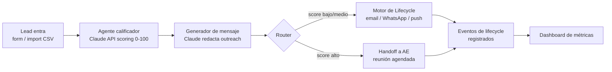

# Clara Growth & Lifecycle Agent — Demo

> Pieza de portafolio construida para demostrar cobertura del rol **AI Growth & Lifecycle
> Automation Engineer** en [Clara](https://www.clara.com) (fintech B2B de LatAm).
> Todos los datos (empresas, leads, mensajes) son **ficticios**, generados para ilustrar
> el sistema, no una integración real con Clara ni con ningún cliente.

Este proyecto es independiente de cualquier otro repositorio o despliegue: no comparte
código, dependencias ni infraestructura con otros proyectos del autor.

## Qué demuestra este proyecto

Clara busca a alguien capaz de construir un sistema que combine agentes de prospección,
automatización de lifecycle, scoring/routing y visibilidad de métricas. Este demo simula
cada una de esas piezas con datos ficticios de PyMEs y empresas medianas de LatAm:

| Feature del demo | Requisito de la vacante |
|---|---|
| Agente de calificación de leads (Claude API) que asigna score y razones | Agentes/workflows de prospección y SDR que califican leads |
| Generador de mensajes de outreach personalizados por segmento | Redacción de outreach personalizado (piensa Amplemarket/Clay) |
| Workflow documentado tipo n8n (JSON exportable + diagrama) | Orquestación tipo n8n o código propio |
| Motor de lifecycle (onboarding/activación/retención) con IA eligiendo canal, timing y contenido | Automatización de lifecycle por email/WhatsApp/push (piensa Customer.io) |
| Reglas de scoring + routing/handoff de SDR a AE | Lead scoring y lógica de routing |
| Dashboard con CAC payback, meetings booked, activation rate, pipeline generado | Dashboard de métricas (piensa Metabase) |

## Flujo end-to-end



## Stack

- **Frontend:** HTML/CSS/JS simple, desplegable en Netlify (evolucionará a Next.js ligero si aporta valor)
- **Backend/datos:** Supabase (Postgres) — ver [`docs/data-model.md`](docs/data-model.md)
- **Automatización:** workflow documentado tipo n8n — ver [`docs/workflow.md`](docs/workflow.md)
- **IA:** API de Anthropic (Claude) para scoring de leads, redacción de mensajes y decisiones de siguiente paso en el lifecycle

## Estructura del repo

```
/public         → sitio estático (landing + dashboard)
/docs           → modelo de datos, diagrama de workflow, notas de diseño
/netlify.toml   → configuración de deploy en Netlify
```

## Ramas y despliegue

- `main` — protegida, solo recibe merges ya validados
- `dev` — rama de integración, cada feature se desarrolla en su propia rama y se mergea aquí vía PR
- Cada rama tiene su preview de Netlify antes de mergear a `dev`, y `dev` antes de mergear a `main`

## Plan de fases

- **Fase 0 (actual):** estructura del repo, README, modelo de datos, diagrama de workflow, esqueleto desplegable en Netlify
- **Fase 1 — MVP demostrable:** tablas en Supabase + seed de datos ficticios, función serverless que llama a Claude para scoring, dashboard con la vista de Pipeline & Routing
- **Fase 2:** generación de mensajes de outreach y decisiones de lifecycle con Claude, resto de vistas del dashboard, workflow JSON exportado
- **Fase 3:** pulido visual, log de actividad del agente en vivo, README final con capturas

## Dashboard — pantallas

1. **Pipeline & Routing** — funnel de leads por etapa, score promedio, % routed a AE, meetings booked
2. **Lifecycle Performance** — activation rate, tiempo a activación, engagement por canal
3. **Growth Economics** — CAC payback estimado, pipeline generado, costo por lead calificado
4. **Agent Activity Log** — feed de decisiones del agente (scoring + mensajes generados)

## Disclaimer

Proyecto de portafolio. Empresas, contactos, montos y conversaciones son ficticios y no
representan datos reales de ningún cliente o empresa existente.
