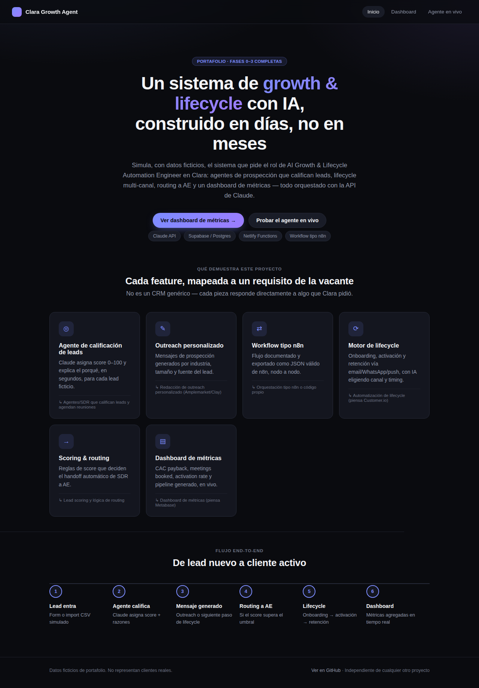
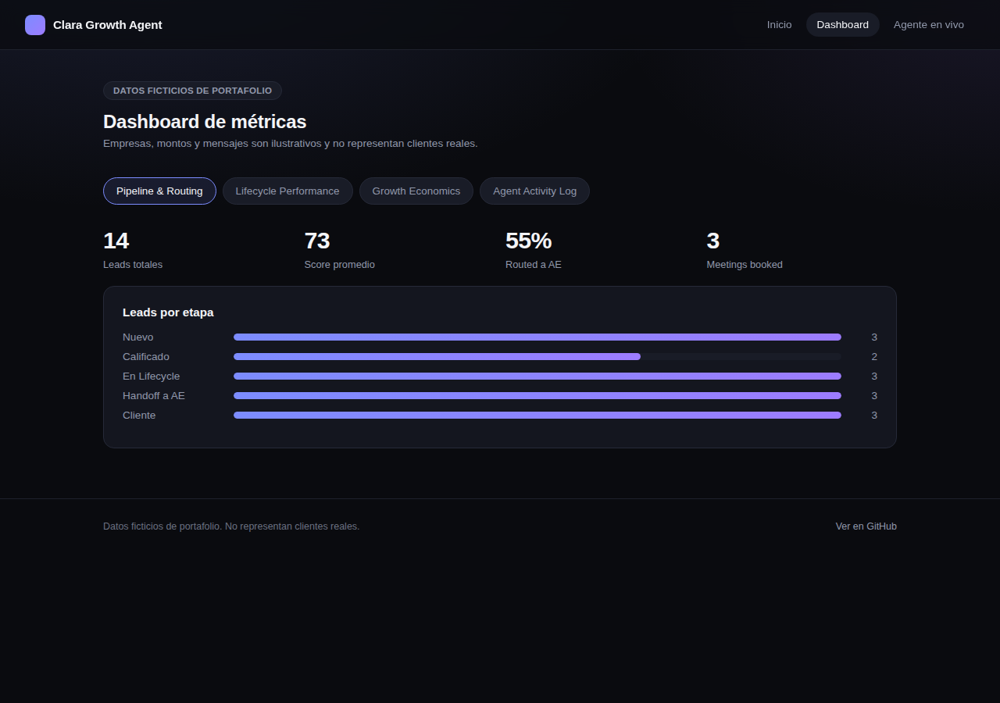
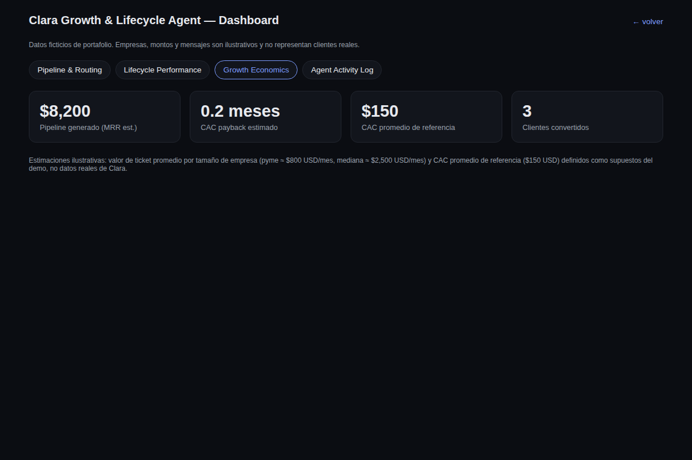
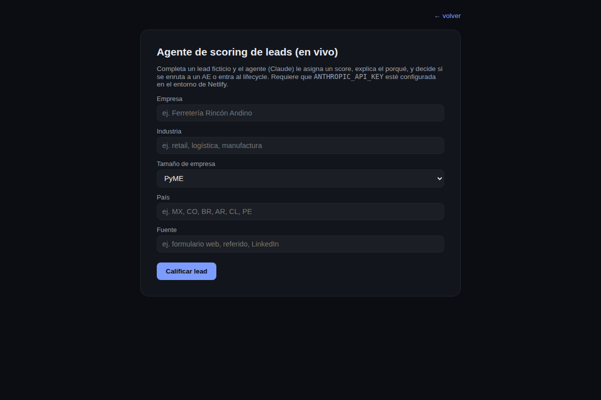
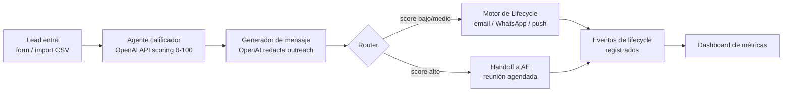

# Clara Growth & Lifecycle Agent — Demo

> Pieza de portafolio construida por **Sarahí Cruz** ([GitHub](https://github.com/apogeoconsara/portafolioclara) ·
> [LinkedIn](https://www.linkedin.com/in/sarahicruzsalazar/)) para demostrar cobertura del rol
> **AI Growth & Lifecycle Automation Engineer** en [Clara](https://www.clara.com) (fintech B2B de LatAm).
> Todos los datos (empresas, leads, mensajes) son **ficticios**, generados para ilustrar
> el sistema, no una integración real con Clara ni con ningún cliente.

Este proyecto es independiente de cualquier otro repositorio o despliegue: no comparte
código, dependencias ni infraestructura con otros proyectos del autor.

## Qué demuestra este proyecto

Clara busca a alguien capaz de construir un sistema que combine agentes de prospección,
automatización de lifecycle, scoring/routing y visibilidad de métricas. Este demo simula
cada una de esas piezas con datos ficticios de PyMEs y empresas medianas de LatAm:

| Feature del demo | Requisito de la vacante |
|---|---|
| Agente de calificación de leads (API de OpenAI) que asigna score y razones | Agentes/workflows de prospección y SDR que califican leads |
| Generador de mensajes de outreach personalizados por segmento | Redacción de outreach personalizado (piensa Amplemarket/Clay) |
| Workflow documentado tipo n8n (JSON exportable + diagrama) | Orquestación tipo n8n o código propio |
| Motor de lifecycle (onboarding/activación/retención) con IA eligiendo canal, timing y contenido | Automatización de lifecycle por email/WhatsApp/push (piensa Customer.io) |
| Reglas de scoring + routing/handoff de SDR a AE | Lead scoring y lógica de routing |
| Dashboard con CAC payback, meetings booked, activation rate, pipeline generado | Dashboard de métricas (piensa Metabase) |

## Capturas

| Landing | Dashboard — Pipeline | Dashboard — Economics | Agente en vivo |
|---|---|---|---|
|  |  |  |  |

## Flujo end-to-end



## Stack

- **Frontend:** HTML/CSS/JS simple, desplegable en Netlify (evolucionará a Next.js ligero si aporta valor)
- **Backend/datos:** Supabase (Postgres) — ver [`docs/data-model.md`](docs/data-model.md)
- **Automatización:** workflow documentado tipo n8n — ver [`docs/workflow.md`](docs/workflow.md) y su exportación en [`docs/workflow.n8n.json`](docs/workflow.n8n.json) (importable a una instancia n8n)
- **IA:** API de OpenAI (modelo `gpt-4o-mini`) para scoring de leads, redacción de mensajes y decisiones de siguiente paso en el lifecycle

## Estructura del repo

```
/public         → sitio estático (landing + dashboard)
/docs           → modelo de datos, diagrama de workflow, notas de diseño
/netlify.toml   → configuración de deploy en Netlify
```

## Ramas y despliegue

- `main` — protegida, solo recibe merges ya validados
- `dev` — rama de integración, cada feature se desarrolla en su propia rama y se mergea aquí vía PR
- Cada rama tiene su preview de Netlify antes de mergear a `dev`, y `dev` antes de mergear a `main`

## Plan de fases

- **Fase 0 (completa):** estructura del repo, README, modelo de datos, diagrama de workflow, esqueleto desplegable en Netlify
- **Fase 1 (completa):** tablas en Supabase + seed de 14 leads ficticios de PyMEs/medianas de LatAm, función serverless (`netlify/functions/score-lead.js`) que llama a la API de OpenAI para scoring en vivo, dashboard con las 4 vistas leyendo datos reales de Supabase
- **Fase 2 (completa):** `netlify/functions/generate-message.js` genera el siguiente mensaje del flujo (outreach a AE, o siguiente paso de lifecycle) en vivo con OpenAI; `public/agent.html` encadena scoring → mensaje en un solo flujo; workflow exportado como JSON tipo n8n en [`docs/workflow.n8n.json`](docs/workflow.n8n.json)
- **Fase 3 (completa):** favicon, capturas embebidas en este README, ajustes finales de UX

## Configuración (Netlify + Supabase + OpenAI)

El proyecto Supabase (`clara-growth-agent-demo`) es independiente de cualquier otro
proyecto — base de datos, credenciales y URL propias. La URL y la anon/publishable key
(de solo lectura vía RLS) están en `public/js/config.js`, son seguras de exponer en
cliente.

Para que el agente de scoring en vivo (`public/agent.html`) funcione, configura estas
variables de entorno en **Netlify → Site configuration → Environment variables**
(nunca en el repo):

| variable | de dónde sale |
|---|---|
| `OPENAI_API_KEY` | tu API key de OpenAI (platform.openai.com) |
| `SUPABASE_URL` | `https://rvopsnpnzonjgdmjxzop.supabase.co` |
| `SUPABASE_SERVICE_ROLE_KEY` | Supabase Dashboard → Project Settings → API (service role, solo server-side) |

Sin `OPENAI_API_KEY` configurada, el resto del sitio (dashboard con datos ya
sembrados) funciona igual — solo el endpoint de scoring en vivo devuelve un error
explicando que falta la key.

**Estado del deploy:** sitio en producción en Netlify
(`https://clara-growth-agent-demo.netlify.app`), repo conectado vía Git,
`SUPABASE_URL`, `SUPABASE_SERVICE_ROLE_KEY` y `OPENAI_API_KEY` configuradas y
verificadas — el agente en vivo funciona end-to-end.

## Dashboard — pantallas

1. **Pipeline & Routing** — funnel de leads por etapa, score promedio, % routed a AE, meetings booked
2. **Lifecycle Performance** — activation rate, tiempo a activación, engagement por canal
3. **Growth Economics** — CAC payback estimado, pipeline generado, costo por lead calificado
4. **Agent Activity Log** — feed de decisiones del agente (scoring + mensajes generados)

## Disclaimer

Proyecto de portafolio. Empresas, contactos, montos y conversaciones son ficticios y no
representan datos reales de ningún cliente o empresa existente.

## Autora

**Sarahí Cruz** — [GitHub](https://github.com/apogeoconsara/portafolioclara) ·
[LinkedIn](https://www.linkedin.com/in/sarahicruzsalazar/)
