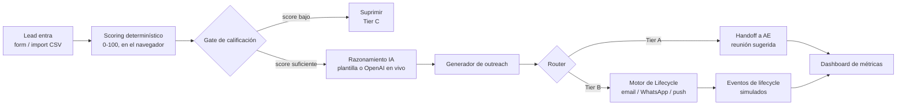

# Clara Growth & Lifecycle Agent — Demo

> Pieza de portafolio construida para demostrar cobertura del rol **AI Growth & Lifecycle
> Automation Engineer** en [Clara](https://www.clara.com) (fintech B2B de LatAm).
> Las **13 empresas del dataset son reales**, investigadas con [Clay](https://www.clay.com)
> a partir de sus propios perfiles corporativos/LinkedIn públicos — su industria, tamaño,
> país y señales de expansión internacional son datos reales; el "dolor actual" de cada una
> es una **hipótesis** que el agente infiere a partir de esas señales, no un hecho confirmado
> por la empresa (ver el detalle de procedencia en `netlify/functions/_clara_agent_shared.mjs`).
> **Esto no es una integración real con Clara ni una campaña activa: ninguna de estas empresas
> ha sido contactada**, y no se incluye el nombre ni el email de ninguna persona real — solo
> evidencia a nivel de empresa. Los montos de Growth Economics (pipeline, CAC payback, costo
> por lead) son ilustrativos y no representan cifras financieras reales de Clara.

Este proyecto es independiente de cualquier otro repositorio o despliegue del autor (por
ejemplo `GTM AI Outbound Engine`, en un repo aparte): no comparte código, dependencias,
dataset ni infraestructura con ningún otro. Se despliega como su propio sitio en Netlify.

## Qué es este proyecto

Corre 13 empresas reales de LatAm (PyMEs y empresas medianas con evidencia pública de
expansión internacional, investigadas con Clay) por un pipeline completo:
intake → **scoring determinístico** (0-100, por tamaño de empresa, dolor actual de pagos/
tesorería y señales de compra) → **gate de calificación** (¿vale la pena gastar cómputo de IA
y tiempo de un SDR/AE en este lead?) → razonamiento de IA (plantilla determinística, o una
llamada real y opcional a OpenAI por lead) → generación de outreach → **routing** en tres
tiers (Tier A → handoff a AE, Tier B → lifecycle automatizado, Tier C → suprimir) → eventos de
lifecycle simulados → dashboard de métricas. Corre 100% client-side en un único
`public/index.html`, con dos Netlify Functions reales y opcionales para el razonamiento de IA
y el chat del agente.

## Qué demuestra este proyecto

| Feature del demo | Requisito de la vacante |
|---|---|
| Agente de calificación de leads: scoring determinístico 0-100 en vivo en el navegador, más razonamiento real vía OpenAI (`gpt-4o-mini`, `lead-reasoning.mjs`) que explica el score y redacta el outreach | Agentes/workflows de prospección y SDR que califican leads |
| Generador de mensajes de outreach personalizados por lead, citando el dolor y la señal de compra reales de cada uno | Redacción de outreach personalizado (piensa Amplemarket/Clay) |
| Workflow documentado tipo n8n (`docs/workflow.md`) + diagrama Mermaid, implementado paso a paso en el pipeline del navegador | Orquestación tipo n8n o código propio |
| Motor de lifecycle (onboarding/activación/retención): eventos simulados por canal (email/WhatsApp/push) y etapa, con activation rate y tiempo a activación en el dashboard | Automatización de lifecycle por email/WhatsApp/push (piensa Customer.io) |
| Reglas de scoring editables en vivo (página "Reglas de scoring") + routing/handoff de SDR a AE en tres tiers | Lead scoring y lógica de routing |
| Dashboard con las 4 vistas: Pipeline & Routing, Lifecycle Performance, Growth Economics, Agent Activity Log | Dashboard de métricas (piensa Metabase) |
| **Chat con el Agente Clara**: agente real vía la API de Anthropic (tool-use loop), que lista/consulta/califica los leads del demo y solo con aprobación humana explícita propone guardar una decisión en el CRM (simulado) | Agentes conversacionales con gates de aprobación humana en acciones de escritura |

## Las 13 empresas (reales, investigadas con Clay)

| Empresa | Industria | Empleados | País | Señal pública principal | Score | Tier |
|---|---|---|---|---|---|---|
| Apiux Tech | Consultoría TI | 305 | Chile | Opera en 5 países; adquirió Nectia y Backspace | 100 | **A** |
| PPU (Philippi Prietocarrizosa Ferrero DU & Uría) | Servicios Legales | 651 | Colombia | Fusión de firmas de Chile, Colombia y Perú, red en España/EE.UU./UK | 85 | **A** |
| Auren Argentina | Consultoría / Finanzas Corporativas | 211 | Argentina | Red ANTEA con oficinas propias en 7 países | 85 | **A** |
| Juguetes Rasti | Manufactura / Juguetes | 80 | Argentina | Exporta a 9 países; distribuida por Mattel en 4 de ellos | 85 | **A** |
| Ginafruit S.A. | Agroexportación (frutas) | 26 | Ecuador | Exporta a China, Japón, EE.UU. y España | 85 | **A** |
| Golderie Trading S.A. | Manufactura de empaques | 97 | Ecuador | Exporta a 7 países; clientes premium (Favorita, Pronaca, KFC) | 85 | **A** |
| Asia Grupo | Consultoría de comercio exterior | 49 | Colombia | Anuncia expansión "próximamente" a 4 países nuevos | 85 | **A** |
| FLP Colombia S.A.S. | Agroexportación (frutas) | 200 | Colombia | Grupo con +30 años exportando desde 3 países andinos | 85 | **A** |
| Beluga Logística | Logística / Freight Forwarding | 120 | México | Abrió oficina propia en Shanghái | 85 | **A** |
| YURA S.A. | Materiales de construcción | 615 | Perú | Parte de Grupo Gloria, presente en 6 países | 70 | B |
| La Virginia | Alimentos y Bebidas | 1289 | Argentina | Recibe insumos de +20 países | 70 | B |
| Configolsa | Manufactura de alimentos (FMCG) | 83 | Ecuador | Fabrica, importa y exporta para mercados internacionales | 70 | B |
| Regina Bananera | Agroexportación (banano) | 321 | Ecuador | Equipo dedicado exclusivamente a exportación | 70 | B |

**Distribución: 9 Tier A, 4 Tier B, 0 Tier C.** No hay Tier C porque las empresas se
seleccionaron deliberadamente por su ajuste al ICP (evidencia real de expansión
internacional) — no se incluyó ningún lead débil solo para completar la distribución. Los
pesos y umbrales exactos que producen esta tabla están en
`netlify/functions/_clara_agent_shared.mjs` (servidor) y se reimplementan línea por línea en
`public/index.html` (cliente) — ver la sección de Arquitectura para por qué no hay una única
fuente de código compartida entre ambos. El "dolor actual" de cada empresa (que junto al
tamaño y las señales determina el score) es una **hipótesis inferida por el agente**, no un
hecho confirmado directamente por la empresa — ver `_clara_agent_shared.mjs` para el detalle
completo de qué es dato real y qué es inferencia.

## Flujo end-to-end



## Stack

- **Frontend:** HTML/CSS/JS en un único `public/index.html`, sin build step, desplegado en Netlify
- **Backend real (opcional):** dos Netlify Functions serverless — `lead-reasoning.mjs` (OpenAI) y `clara-agent-chat.mjs` (Anthropic) — más `leads-data.mjs` (sirve el dataset) y `confirm-crm-action.mjs` (simula el guardado en CRM tras aprobación humana)
- **Datos, hoy:** dataset fijo de empresas reales (investigadas con Clay) en `netlify/functions/_clara_agent_shared.mjs`
- **Datos, en producción:** Supabase (Postgres) — ver [`docs/data-model.md`](docs/data-model.md)
- **Automatización:** workflow documentado tipo n8n — ver [`docs/workflow.md`](docs/workflow.md)
- **IA:** API de Anthropic (Claude Haiku) para el chat del agente, API de OpenAI (`gpt-4o-mini`) para el razonamiento de calificación y outreach en vivo

## Estructura del repo

```
/public/index.html                       → app completa (HTML + CSS + JS), un solo archivo
/netlify/functions/_clara_agent_shared.mjs → dataset de empresas reales (Clay) + scoring determinístico (fuente única para el servidor)
/netlify/functions/leads-data.mjs         → GET: sirve el dataset + score al navegador
/netlify/functions/lead-reasoning.mjs     → POST: razonamiento + outreach en vivo vía OpenAI
/netlify/functions/clara-agent-chat.mjs   → POST: chat del Agente Clara vía Anthropic, tool-use loop con gate de aprobación humana
/netlify/functions/confirm-crm-action.mjs → POST: "ejecuta" (siempre simulado) una acción de CRM aprobada
/docs                                     → modelo de datos, diagrama de workflow, notas de diseño
/netlify.toml                             → configuración de deploy en Netlify (publish + functions)
```

## Cómo correrlo

Es un sitio estático sin build step para el frontend. Para verlo con solo el pipeline
determinístico, abre `public/index.html` directamente en un navegador (cae a un dataset local
de respaldo si no hay Netlify Functions disponibles). Para las dos funciones de IA en vivo,
despliega `public/` + `netlify/functions/` en Netlify (o corre `netlify dev` localmente) usando
este `netlify.toml`.

## Modo OpenAI en vivo (opcional)

Desde el detalle de cualquier lead hay un botón "Ejecutar razonamiento en vivo (OpenAI)" que
llama a `/.netlify/functions/lead-reasoning`, una Netlify Function que sostiene la
`OPENAI_API_KEY` del dueño del sitio del lado del servidor y hace una llamada real a
`gpt-4o-mini` para reemplazar, solo para ese lead y esa sesión de navegador, la plantilla
determinística del paso de razonamiento y outreach. El visitante no necesita pegar ninguna
credencial propia — la función solo acepta las 13 empresas que ya están en el dataset
público, para no convertirse en un proxy abierto de prompts arbitrarios. La respuesta incluye tokens
reales, latencia y costo estimado, mostrados en el panel y sumados a un "gasto de IA"
acumulado visible en Growth Economics. El score y la decisión de routing no cambian — siguen
siendo deterministas.

**Para activarlo**, agrega `OPENAI_API_KEY` en el dashboard de Netlify de este sitio (Site
configuration → Environment variables). Si no está configurada, el botón lo indica
explícitamente en vez de fallar en silencio.

## Agente Clara (chat) — Claude en vivo (opcional)

Página separada ("Agente Clara (Demo)") donde el visitante chatea en español con un agente que
decide qué herramientas llamar (`list_leads`, `get_lead`, `score_lead`) contra el mismo
dataset de empresas reales, vía un tool-use loop directo a la API de Messages de Anthropic en
`clara-agent-chat.mjs` — no el `claude-agent-sdk`, porque ese SDK necesita un proceso de larga
duración y esto corre en una función serverless sin estado entre invocaciones.

**Gate de aprobación humana:** la única herramienta de escritura, `request_crm_action`, nunca
se ejecuta sola. Cuando el modelo la llama, la función se detiene y regresa una solicitud
pendiente; el visitante debe hacer clic explícito en "Aprobar" antes de que se llame a
`confirm-crm-action.mjs` — que, sin importar el resultado, **siempre simula**, porque este
proyecto no tiene ninguna integración real de CRM (ver Arquitectura).

**Para activarlo**, agrega `ANTHROPIC_API_KEY` en el dashboard de Netlify de este sitio. Si no
está configurada, el chat lo indica explícitamente en vez de fallar en silencio.

## Seguridad por diseño

- Ambas funciones de IA (`lead-reasoning.mjs`, `clara-agent-chat.mjs`) solo aceptan las 13
  empresas fijas del dataset — no son un proxy abierto de prompts arbitrarios.
- El tool-use loop del chat está limitado (`MAX_TOOL_ITERATIONS`) y la conversación entrante
  tiene un tope de tamaño (`MAX_MESSAGES`, `MAX_BODY_CHARS`), para que un visitante no pueda
  disparar llamadas de modelo ni contexto sin límite.
- El score/tier/ruteo que se guarda en `request_crm_action` siempre se recalcula
  server-side a partir del nombre del lead — nunca se confía en la copia que el modelo
  pudiera inventar o alterar.
- `confirm-crm-action.mjs` nunca escribe en un sistema externo real, sin importar el input:
  no existe ningún conector de CRM implementado en este proyecto todavía.

## Plan de fases

- **Fase 0:** estructura del repo, README, modelo de datos, diagrama de workflow, esqueleto desplegable en Netlify
- **Fase 1 (entregado):** dataset de empresas reales (investigadas con Clay) + scoring determinístico en `_clara_agent_shared.mjs`, Netlify Function `leads-data.mjs`, dashboard con la vista de Pipeline & Routing
- **Fase 2 (entregado):** generación de outreach y razonamiento de calificación en vivo vía OpenAI (`lead-reasoning.mjs`), chat del Agente Clara vía Anthropic con gate de aprobación humana (`clara-agent-chat.mjs`, `confirm-crm-action.mjs`), resto de vistas del dashboard (Lifecycle Performance, Growth Economics, Agent Activity Log), panel de Reglas de scoring editable en vivo, sección de Arquitectura
- **Fase 3 (pendiente):** integración real con Supabase como sistema de registro, workflow n8n exportado como JSON, pulido visual adicional

## Dashboard — pantallas

1. **Pipeline & Routing** — funnel de leads por etapa, score promedio, distribución de tiers, tasa de handoff a AE
2. **Lifecycle Performance** — activation rate (estimado), tiempo a activación, engagement por canal y etapa — eventos simulados, etiquetados como tales
3. **Growth Economics** — CAC payback estimado, pipeline generado, costo por lead calificado — todos ilustrativos, con sus supuestos mostrados explícitamente
4. **Agent Activity Log** — feed de decisiones del agente (scoring + outreach) más el historial real de llamadas a las Netlify Functions hechas en la sesión

## Arquitectura: prototipo actual vs. diseño de producción

Ver la página "Arquitectura" dentro del demo para la tabla completa. En resumen: hoy el
scoring, el routing y el dashboard corren determinísticamente en el navegador; el
razonamiento de IA y el chat del agente son llamadas reales y opcionales a OpenAI/Anthropic
desde Netlify Functions; y el guardado en CRM está simulado porque no hay ninguna integración
real de CRM en este proyecto. Una versión de producción reemplazaría el dataset fijo por
Supabase, el workflow simulado por un orquestador real (n8n o equivalente), y la simulación de
CRM por una integración real — sin cambiar el resto del flujo.

## Disclaimer

Proyecto de portafolio. Las 13 empresas del dataset son **reales**, investigadas con Clay a
partir de sus propios perfiles corporativos/LinkedIn públicos — pero **ninguna ha sido
contactada y esto no es una campaña activa de Clara**. El "dolor actual" de cada empresa es
una hipótesis que el agente infiere a partir de sus señales públicas, no un hecho confirmado
directamente por la empresa. No se incluye el nombre ni el email de ninguna persona real —
solo evidencia a nivel de empresa. Los montos de Growth Economics y las conversaciones del
chat/eventos de lifecycle son ilustrativos/simulados, no cifras financieras ni interacciones
reales de Clara, y los pesos/umbrales de scoring son ilustrativos y configurables, no el ICP
interno real de Clara.
