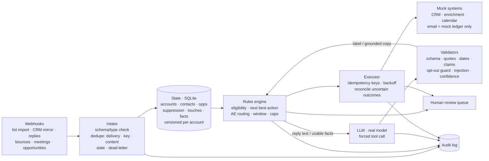

# Growth Orchestration System — Clara challenge

A working vertical slice of the system the challenge describes:

```
event → state → decision → AI/rules → action → audit
```

Webhook events update persistent account/contact state; deterministic rules decide eligibility and the next best
action; a **real LLM** interprets replies (label + qualification extraction) and personalizes copy from verified facts
only; every external call goes through idempotency keys, retries and reconciliation against mock CRM, enrichment,
calendar and email systems; every step is written to an audit log. All data is synthetic, and **no email is ever
sent**: outreach is written to a mock ledger, by construction.

- Live page: the Netlify site (https://clara-growth-agent-demo.netlify.app) — recorded engine runs of every scenario,
  a live AI panel and a live eval button.
- Docs: [decision log](docs/DECISION_LOG.md) · [AI: scope, validation, autonomy](docs/AI.md) ·
  [measurement plan](docs/MEASUREMENT_PLAN.md) · [production thinking](docs/PRODUCTION.md) ·
  [data](data/README.md) · [policy](data/POLICY.md) · [challenge traceability](data/PDF_TRACEABILITY.md)

## Quick start (Python 3.11+, no dependencies; node 20+ only for the web tests)

```bash
python3 -m unittest discover -s tests -t .        # 119 tests: data, rules, engine, AI validators, web parity (incl. node tests)
python3 -m orchestrator export-overview             # 50k summary + operations metrics for the web page (needs `make data` first, about a minute)
python3 -m orchestrator demo                      # the six demo flows (five on the page, D5 under "More cases"), step by step (offline fixture for AI steps)
python3 -m orchestrator stream                    # 561 sample deliveries through one engine instance
python3 -m orchestrator eval --recorded           # validators vs 220 recorded model outputs (no model call)

export ANTHROPIC_API_KEY=...                       # in your shell only, never in a file
python3 -m orchestrator eval --live               # 18 core cases against the real model -> evals/results/
python3 -m orchestrator demo --flow D4 --live     # ambiguous / unsafe AI flow with the real model
python3 -m orchestrator serve --port 8080         # local webhook receiver: POST /webhook, GET /accounts/<id>

python3 -m orchestrator export-web                # regenerate the page data + the prompts module for the function
python3 -m generator all --seed 42 --n 50000      # regenerate the 50k-account synthetic world (~1.5 min)
```

## Architecture



| module | role |
|---|---|
| `orchestrator/ingest.py` | envelope validation, three-way dedupe, stale updates, dead-letter |
| `orchestrator/state.py`, `db.py` | persistent state; every write bumps the account version |
| `orchestrator/rules.py`, `routing.py`, `windows.py` | eligibility + next best action (policy v0), AE routing, send window |
| `orchestrator/ai/` | prompts (single source), LLM client, validators, reply interpretation, grounded drafting, offline fixture |
| `orchestrator/executor.py`, `retry.py`, `mocks.py` | external effects: idempotency, retries, reconciliation, mock ledgers |
| `orchestrator/engine.py` | the loop: event handlers, decisions, AI calls, scheduled sends (`run_due`), audit |
| `orchestrator/evals.py` | live and recorded eval suites |
| `orchestrator/webexport.py` | page data and generated JS modules for the Netlify function |
| `../netlify/functions/orchestrator-llm.mjs` | live AI endpoint (key server-side, no email code) + JS validators, parity-tested |

## What the slice covers (challenge → where)

| requirement | where it is shown |
|---|---|
| webhook trigger | `serve` (HMAC-verified when `ORCH_WEBHOOK_SECRET` is set); every scenario starts from webhook envelopes |
| persistent state | SQLite state + ops tables (inbox, decisions, actions, audit_log, review_queue, ai_calls) |
| eligibility + next best action | `rules.py`: 500/500 against the independent truth; 89/89 golden scenarios through the engine |
| meaningful LLM capability | reply interpretation + extraction, grounded personalization ([AI.md](docs/AI.md)) |
| structured, validated AI output | forced tool calls + `validate.py` (V001–V012, G001, P001–P015) |
| mock integrations | CRM, enrichment, calendar, email with every failure mode in `mock_api_contracts.json` |
| duplicates / idempotency | G040–G042, G053; replaying every delivery changes nothing (test) |
| failure / retry | G070–G078, G110–G117: 503, 429, timeouts, uncertain outcomes, conflicts, exhaustion |
| ambiguous / unsafe AI | G064–G067 + 220 recorded outputs; injection, mixed signals, hallucinated fields |
| tests | `tests/` (Python unittest) + `tests/js/` (node, run by the Python suite) |
| AI eval | `evals/results/` (recorded suite committed; live suite runs with a key or from the page) |

## Key decisions and tradeoffs

- **Model proposes, deterministic code disposes.** The model labels and extracts; rules choose the action, the AE, the
  timing and whether anything is sent. Opt-outs are honoured by rules even if the model disagrees or is down.
- **Safety over automation rate**: anything uncertain goes to a human queue instead of being guessed.
- **Exactly-once by idempotency key + lookup before retry**, so uncertain outcomes never become double sends.
- **Re-decide at send time**: a deferred email is cancelled if a suppression, reply or deal arrives first.
- **Recorded vs live, always labelled**: recorded runs use a deterministic offline fixture so they are reproducible; live
  results come only from the real model.

Full reasoning, what was not built, and the biggest production risk: [docs/DECISION_LOG.md](docs/DECISION_LOG.md).

## Provenance

The synthetic world is generated by code in `generator/` from seeds. The reply seeds, golden scenarios and recorded model
outputs were drafted with an AI assistant and are pending my full human review (see `prompts/reply_generation.md`
for the review protocol). No real companies or people are included.
